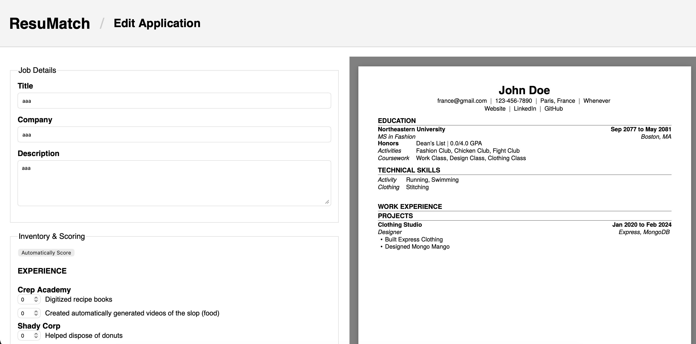

# ResuMatch

Simplify Matching Relevant Experience to Job Applications.

## Authors

Hazem Algendy & Shuwen Luo

## Page Deployment Link

http://18.221.43.153:3000 (AWS)

## Class Link

https://northeastern.instructure.com/courses/245751

## Design Document

https://docs.google.com/document/d/1x_vGD0fviBs3O3k6RxZfKEBqB9shNf6ob_ZQz93m0KI/edit?usp=sharing

## Project Objective

To build a full-stack web application using Node.js, Express, MongoDB, and Vanilla JS that automatically tailors and formats a professional PDF resume. It allows users to manage a centralized career inventory and uses a custom constraint-solving "Lifeboat Algorithm" to mathematically fit their highest-scored bullets into strict page limits using dynamic LaTeX compilation.

## Screenshot

## demo video

## Instructions to build

### Prerequisites
* **Node.js**
* **MongoDB**
* **LaTeX (pdflatex)**

### Setup Steps
1. Clone the repository: `git clone <repo-url>`
2. Navigate to the project folder: `cd resumatch`
3. Install the dependencies: `npm install`
4. Create a `.env` file in the root directory and add your database string: 
   `MONGO_URI=mongodb://localhost:27017/resumatch`
5. Optionally run the seed script to populate dummy application data: `node seed.js`
6. Start the server: `npm start`
7. Open your browser and navigate to `http://localhost:3000`

*(If using Docker: simply run `docker compose up --build`)*

## License
MIT License
